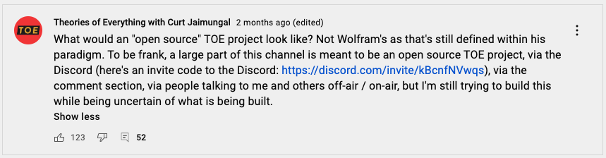

==================================================
Example: An Open Source Theory of Everything (TOE)
==================================================

    :Author: David Joseph

.. contents::

Spontaneous Collaboration
-------------------------

Enabling spontaneous intellectual collaboration is one of Unrival's premier use cases.  A broad intellectual project can be defined, even somewhat vaguely, and those it speaks to can build it up from humble foundations.  We'll develop an example of this taking the following proposal by Curt Jaimungal on his `Theories of Everything <https://www.youtube.com/c/TheoriesofEverything>`_ channel as our starting point:

Some of the questions we'll propose answers to:

- how do the right people (i.e. those with the required interest and intellectual capabilities) become part of such a pursuit?

- how can lesser deserving ideas/theories be weeded out?

- how can agents with compatible views (but possibly different terminologies) build off of each other's efforts?

Using Unrival
~~~~~~~~~~~~~

Unrival can also be useful for helping teams of developers coordinate tasks.  For developers who prefer working from the command line, a cli tool is available:
`unrival cli <https://github.com/unrival-protocol/unrival_cli>`_.  For those familiar with git, the workflow is very similar: objects are created by adding and committing.  The key difference is that the Unrival protocol adds an assertion layer to help teams develop by consensus.  When a change to a codebase is suggested, a decision can be created that asks developers to voice their opinions on whether to incorporate the change.  If the decision has a time limit, the change might be automatically applied, depending on the result of the vote.  In this way, teams of developers can spontaneously collaborate on projects without an imposed hierarchy.  Let's see how this might play out:

Workflow
--------

.. note::

    In the following example, we assume that a group of theorists has a common goal: to construct a theory of everything.

    This is unlikely to happen spontaneously in the absence of centralization, but our focus is on how effective collaboration can proceed once such a group is formed.  The purpose of Unrival's *Goal* and *Proposal* objects is to address this problem of spontaneous group formation.

Setup
~~~~~

26 theorists {A..Z} intend to develop of TOE.  They have access to the same git repository, and they will explicate their theory in documents tracked by this repo.

Commit 0
~~~~~~~~

The name of the project is added to a ``README.md`` file and this file is committed to become the initial commit.  The group begins tracking the file.

.. code:: bash

    $ unrival add README.md
    $ unrival commit -m "initial commit"

Commit 1 - choose an ``interpretation``
~~~~~~~~~~~~~~~~~~~~~~~~~~~~~~~~~~~~~~~

Unrival objects can (but are not required to) have an ``interpretation``, which places them within a wider context.

.. code:: bash

    $ echo '\toe' | unrival add
    # added Qma5SJCqtR1iv7eRwnmWkPkBq1XFr16QMKAvEcYNjNRTU3 Qma5SJCqtR1iv7eRwnmWkPkBq1XFr16QMKAvEcYNjNRTU3
    $ unrival commit -m "created interpretation - \toe"

Commit 2 - create base object
~~~~~~~~~~~~~~~~~~~~~~~~~~~~~

The first step is to create an object to store any data relevant to this project:

.. code:: bash

      $ echo '[
        {
            "interpretation": "/interpretation",
            "address": "Qma5SJCqtR1iv7eRwnmWkPkBq1XFr16QMKAvEcYNjNRTU3",
            "protocol": "ipfs"
        }
    ]' | unrival add
      # added QmUD8hNG3pp6rKGYHPmfXopZsQZmttbCSsRoKg1yLVkh61 QmUD8hNG3pp6rKGYHPmfXopZsQZmttbCSsRoKg1yLVkh61    

Now we have an Unrival object with nothing but an ``interpretation`` - this is analagous to an empty webpage that's been assigned a domain name.

Commit 3 - create claims
~~~~~~~~~~~~~~~~~~~~~~~~

In order to come to a common understanding of what this project is about -- or better stated, what a ``/toe`` is supposed to be -- one of the agents creates a ``claim`` object.

A claim should be created for any object that can benefit from user feedback.  For example, a scientific theory is dependent on user feedback in the form of falsification, so it would be appropriate to attach at least one claim to it.  This applies for TOEs as well.

.. note::

    Most objects we'll be dealing with from here on out will be too complex to add via standard input on the command line, so we'll store their data in files before adding them to unrival.

.. code:: json

    [
        {
            "interpretation": "/interpretation",
            "address": "",
            "protocol": ""
        }
    ]

Commit 4 - attach claims to base object
~~~~~~~~~~~~~~~~~~~~~~~~~~~~~~~~~~~~~~~

Commit 5 - create TOE instance
~~~~~~~~~~~~~~~~~~~~~~~~~~~~~~

Commit 6 - construct ontology
~~~~~~~~~~~~~~~~~~~~~~~~~~~~~

Commit 7 - update claims on object
~~~~~~~~~~~~~~~~~~~~~~~~~~~~~~~~~~

Commit 8 -
~~~~~~~~~~
