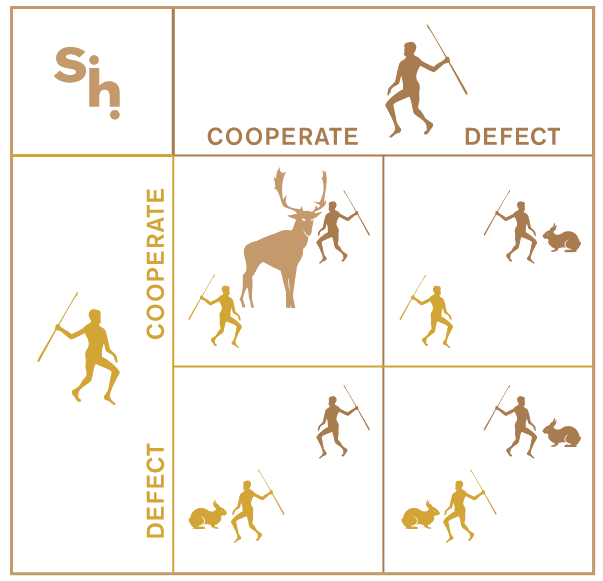

==========
Whitepaper
==========

    :Author: David Joseph

Abstract
--------

Unrival is a protocol that enables agents to cooperate more effectively on accomplishing common goals, or to become aware of them when surface-level conflicts appear more imminent.  Agents communicate their intentions via a set of shared objects that constitute bottom-up, composable building blocks for maintaining complex social and economic relationships founded on mutual understanding and accountability.  These objects are not mere mental or social constructs - they have a physical existence as data that agents can interface with via client applications.  

**UNIVERSAL FEEDBACK**

Any thing about which certain properties can be confirmed or denied by third parties (be they humans or computer programs) is an eligible Unrival object.  This may leave out some things, such as first-person experiences or inherently unfalsifiable claims, but most things are included;  in particular, those things with compromised credibility as of late, upon which many people may nonetheless come to depend, such as political parties, medicines, lawyers, etc.  These are things for which honest, accurate feedback is both necessary and hard to come by.  Thus, the Unrival protocol is addressing an important, unmet need.

The credibility of these things can be asserted by their proponents, and confirmed or denied by the agents who experience them first hand.  Furthermore, these claims and the corresponding assessments thereof are accessible to all agents.  Of course, if the problem of eliciting and hosting honest feedback can be solved for objects like the above, the solution will also apply to the conventional subjects of rating systems, like books, films, restaurants, etc.

**RECTIFICATION OF NAMES**

Properties that can be validated or checked are not limited to credibility scores.  More broadly, Unrival can be seen as a way of ensuring that data located at distinct addresses within a network will satisfy certain conditions.  It also includes a namespace system for binding natural language references to these addresses.  This is intended to ensure that natural language, which has more potential for misuse than constricted/constructed language, can also benefit from built in validation.  (Incidentally, this can also be seen as a technological strategy for `rectifying names <https://en.wikipedia.org/wiki/Rectification_of_names>`_ à la Confucius).

**IMPLEMENTATION**

The protocol itself can be stated as `a set of guidelines <protocol.html>`_, which are open to interpretation as far as technological implementation goes.  We describe one implementation in this document, but it is by no means definitive.  

Overview
--------

Introduction
~~~~~~~~~~~~

Unrival seeks to pave a road to cooperation when defection seems to be, in the realest sense, the more rational choice for self-interested agents.  As it is meant to be realistic and not fantastic, it does so without appealing to the moral inclinations of its subjects - but instead by re-framing self-interest and laying bare latent incentives to cooperate.

But, where agents stand to benefit maximally by cooperating, shouldn't they be doing so already?  This may seem paradoxical, but not always.  Think of Mutually Assured Destruction: although individual nations may prefer all-around nuclear disarmament, they'd be crazy (by this calculus) to adopt this strategy - doing so would only give other nations a leg up in the struggle for international dominance, and would be very unlikely to bring about the optimal outcome.  Thus, in a nuclear-armed world, nations are trapped in a *race to the bottom*.

In short, our problem boils down to: *how can we cooperate when we are stuck in rivalrous equilibria*?  Unrival is an attempt at a technological answer to this question.  Our answer starts with a set of shared concepts, the use of which lowers the coordination costs (e.g. the requisite energy, the inherent risk, and so on) associated with cooperation.  This has the effect of putting maximally beneficial outcomes within agents' reach.  Hence our claim that *agents using Unrival outcompete those that don't*.  Seen from the point of view of evolutionary biology (specifically,  `multi-level selection theory <https://en.wikipedia.org/wiki/Group_selection#Multilevel_selection_theory>`_): *although selfish individuals beat non-selfish individuals, non-selfish groups beat selfish groups*.  In brief: **Unrival is a technology for creating non-selfish groups**.

The Stag Hunt
~~~~~~~~~~~~~

*We'd like to take this opportunity to drive home the notion that greater benefit is sometimes theoretically possible, but is nonetheless passed over by self-interested agents. Readers who are familiar with game theory may feel free to skip this section.*

The following scenario was introduced by Rousseau in his `Discourse on Inequality <https://en.wikipedia.org/wiki/Discourse_on_Inequality>`_:

    …two individuals go out on a hunt. Each can individually choose to hunt a stag or hunt a hare. Each player must choose an action without knowing the choice of the other. If an individual hunts a stag, they must have the cooperation of their partner in order to succeed. An individual can get a hare by himself, but a hare is worth less than a stag.

This leads to a paradoxical situation in which *acting rationally* means *settling for a sub-optimal outcome*.  Although both hunters would rather come home with a stag, they are forced to hunt for hares - otherwise they could be left with nothing.

**Key Takeaways**

- There exist paradoxical situations in which self-interested agents choose strategies leading to suboptimal outcomes.

- Should agents attempt to cooperate, they are confronted by some difficulties:     

  - Communication may be impossible, impractical, or so costly that, even if it should it lead to optimal outcomes in the short-term, nonetheless offsets the benefit gained therefrom in the long-term.  Besides the costs of physical media, like smoke signals and fiber optics, this costliness may materialize in:

  - The ability of agents to deceive one another, whereby they forego an ideal outcome but gain the upper hand over their rivals.

Thus, there are no simple solutions to coordination problems, as proposed solutions (e.g. better, faster communication channels) often enable more efficient deception for any added benefit.  Unrival strives to be a meta-game for finding solutions that are immune to this type of weaponization.

The Meta-Game
~~~~~~~~~~~~~

One thing is certain: it really is the most rational choice for hunters to hunt for hares - *within the confines of the staghunt game*.  But games aren't real life; their rules don't necessarily reflect the full range of choices available to agents.  It may also be possible to play a meta-game that can improve outcomes within any given game.

The subject of this paper is a group protocol for playing meta-games.  Such a protocol should confer enough benefit on its users to outweigh any costs associated with its use.

The Meta-Crisis
~~~~~~~~~~~~~~~

If we accept that a meta-game is possible that would enable us to improve outcomes beyond the declared limits of a given game, we must also be prepared to consider the costs of losing.  We who are playing (i.e. everyone, aware or not of the fact) are, for all intents and purposes, not fairing well so far.

For starters, take any impending crisis requiring mass cooperative effort to avert.  E.g.:

- climate change

- global pandemics

- proliferation of WMDs

(*Sadly, what to include in this list will be considered a political statement by some. This gets at the root of what we call the meta-crisis...*)

Each of the above crises (indeed, any crisis) is undergirded by a crisis of another order, thwarting our attempts to sensemake and respond rationally to the crisis at hand.  We call this the **meta-crisis**.  Just as the effects of global warming are apparent to anyone willing to look at the data, the effects of this crisis are also apparent in our global inability to respond adequately to the most pressing challenges.  And in order to respond adequately, we must regain the capacity to engage in civil dialogue with one another.  Yet, even as the physical environment gets warmer, the social environment `gets cooler <https://www.socialcooling.com/>`_.

The Internet of Goals
~~~~~~~~~~~~~~~~~~~~~

We'll now shift our focus from problems to some historical attempts at solutions, and how Unrival intends to fit among them.

- The internet turned computing from a *monologue* to a *dialogue* (or a whole host of dialogues).

- The web did the same for content creation and can be considered the *internet of HTML websites*.

- We sometimes refer to new technologies as the *internet of X*, where X purportedly does for some subject what the internet did for computing - that is, democratize, interconnect, and so on.

- For example, Bitcoin has been called the `the Internet of Money <https://theinternetofmoney.info/>`_, and has been claimed to do for money what the web did for humanly-digestible text.

- The subjects of such claims (and the claims themselves) can be turned into Unrival objects, opening a channel of meaningful feedback pertaining to these claims.  For agents, the strategic advantage gained thereby would be the ability to know whether these claims have been substantiated.

- Naturally, not all objects have the potential to inspire dialogue with significant growth factor.  One particular object that may is the `Goal`_.  This is because:

  - Individuals, especially those raised on social media, have a difficult time connecting with others in non-superficial ways.  This is largely a result of the media on which they coalesce; if platforms adopt the strategy of `limbic hijacking <https://www.fastcompany.com/1836569/hijacking-emotion-key-engaging-your-audience>`_ (which they must, in order to stay competitive), then their users' screen time will tend to increase to the detriment of their mental health.  Because humans have social needs, despite their social quarantining by "social" media, creating the illusion of social interaction is a significant value proposition for platforms.  Customers are all too willing to outsource their heretofore instinctual social bonding capacity to these platforms.  A way to share desires deeper than seeing the next Marvel movie is much needed in this meaning vacuum.  Thinking in terms of goals necessitates cognizance of desires or needs deeper to the surface-level behaviors these goals motivate.  Thus, an a social network based on an internet of goals could serve as a medium of meaningful human bonding.  *Would you rather connect with others who share the same goals as you, or with others who took the same clickbait?*  Today's social media platforms produce the latter.

  - Clarity regarding goals is a missing element of many group endeavors, and an easy way to achieve this would be readily adopted by many.

  - Goals, whether their subscribers are conscious of them or not, already underlie every action we perform.  Many subpar group performances are due to the inability of group members to unite under the same goal, such that their individual efforts may be combined, instead of dissipating in directionlessness.

To make this last point more concrete, imagine what an *Internet of TODO lists* might look like:

The act of TODO list creation will have been turned from monologue to dialogue, for which a group decision making mechanism is both a pre-requisite and an end result (which is a property common to complex systems, and not a contradiction in terms as it may seem).

But first, It may be necessary to provide some motivation for such a curious use of networking technology.  A single, top-level TODO list could exist for a group of agents of arbitrary size, representing these agents' common goals.  TODO items requiring more deliberation could be nested TODO lists themselves.  All lists and items could be curated through a combination of meritocratic and democratic selection processes.  Now, please suspend your skepticism for a moment and allow yourself to imagine a top-level reflecting the needs of all of humanity (condensed to 10 items), each being nested to a degree proportional to the depth of the problem to be solved.  It may have the appearance of a top-down list of orders, but in actuality consist of organically-grown units of wilful compliance, coming together through consensus.  It could benefit from the advantages of centalization (e.g. clarity of purpose and direction) and decentralization alike.  Given the ability to create such lists, *and enough users involved in its creation*, it's conceivable that an adequate response to `The Meta-Crisis`_ could be realized.  

How do we get there?  How are TODO items to be prioritized?  Who can interact with them?  All of these rules may be enforced by `Proof`_.  The following illustrates some conditions that may be required of data consumable by client applications:

.. code:: org-mode

    * A todo list is associated with an interpretation.
    * A todo list may have at most 10 todo items.
    * The 10 todo items listed in a todo list are the TODO items with the highest rating attached to this interpretation.
    * Each todo item may also be a todo list.
    * A todo item has an interface that allows it to be created, edited, or deleted.
    * Only agents subscribing to the interpretation with which it is associated by perform these actions.

.. note::

    The above is written in natural language for sake of comprehensibility, but code examples are readily available

We will develop this notion further using *goals*, which can subsume the TODO item and offer more advanced functionality pertaining to collaboration and responsibilities.  First we'll consider the consequences of such an internet, should it take hold.

The Goal Engine
~~~~~~~~~~~~~~~

**UNMET NEEDS**

Search engines are so inextricable from the typical web experience, it's becoming difficult to tell how well they are accomplishing their goals, let alone what these goals might be.  The naive view wouldn't ascribe any goals beyond delivering relevant results to the searcher.  Perhaps 20 years ago, this would have been a defensible position - but nowadays, few would call search results unbiased.  After all, search engines are maintained by private companies with various motives tangential to or in conflict with the image of neutrality they'd like to assume (e.g. cultural relevance, political influence, financial gain, and so on; search engines censor search results, bow to the demands of dictators, and profit from private data).  Conflicts of interest are built in to the business model.  An informed view of the goals of search engines, therefore, would conclude that delivering relevant, accurate search results is only a subgoal, and only important insofar as it advances bthese primary goals.

**MADE EXPLICIT**

We've been building up the case -- and the infrastructure -- for another sort of 'engine', the goal of which would be *connecting agents with the means of accomplishing their own goals* - not those of the faux unbiased.

Moreover, we may already have the basis for such an affordance, given the goal object introduced above.  We know that users have implicit goals that turn them on to search engines; the question we'll now address is *whether making these goals explicit would be a more human-centric design that empowers users as intended*.  This would call for a slightly different search experience.

For starters, the text input field may be expecting the completion of the sentence **"I want ..."**, rather than being a self-invitation (on the part of search providers) to inundate with clickbait.  And what sort of resources would the user then be connected to?  For the goal:

.. code:: org-mode

    I want to learn calculus

the most natural result would be a goal object including references related to the accomplishment of this goal (e.g. tutorials, courses, tutors, etc).  Furthermore, this goal, being a complex object, may inherit from other goals:

.. code:: org-mode

    I want to learn algebra

.. note::

    The exact phrasing of these goals is unimportant; with the `Namespace`_, we can define names that are functionally equivalent, and provide support for multiple languages.

If we stumble upon a tutorial connected to a goal in this way, we can already take advantage of Unrival objects' ability to explicitly inherit from ancestors (which we'll cover in the section on `Indirect Proof`_).  In this case, it's easy to make clear that one goal is dependent upon another.  So, unfortunately, you may be required to learn algebra before calculus.  *But at least this will be obvious to you!*  

**MADE SYMMETRIC**

One of the greatest strengths of the web -- its enabling of anyone, just about anywhere, to create content -- may also be its Achilles' Heel.

::

    "A lie can travel around the world and back again while the truth is lacing up its boots." - Mark Twain

...and this is especially apparent in our current media environment.  Even so, this institutional view is only half the problem: it's also all too easy for individuals to misrepresent/deceive.  This takes various forms: from book reviewers leaving dishonest reviews for personal gain to fake social media profiles used for phishing, it's seems nothing is beyond exploitation.

We are talking about information asymmetry, or one side of a communication knowing less than the other side, and this being used against them.  Conventional answers to this problem are such things as "likes",  consumer advocate periodicals, and other means of signalling.  Unfortunately, these are not able to ensure that those signalling truly have skin in the game.  What is needed are subjective and objective ways of evaluating the integrity of signals, such that the signaller benefits or is penalized proportionally.  This is fulfilled by Unrival's `Claim`_ object, which creates a public feedback receptacle that converges on accurate representations of real opinions.

There is much work to be done in designing mechanisms for incentivizing honesty, but we believe the infrastructure for doing so should start with the explication of claims and assessments, made possible by Unrival.

**SUPER APPS**

So called "super apps" are growing in prevalence.  These apps implicitly encourage users to give up the struggle of choosing their own services, and give in to a single platform purportedly capable of everything.  Obviously this is cause for concern: we know by now that the corporations vying for our dependence have incentives misaligned with our own.  But we also see this trend as more or less inevitable.  An everything-platform is nothing if not convenient, and resistance may be futile.  Maybe there's a middle way: *to create a super app that elevates users' goals*.

We've already established some competitive advantages in using the Unrival Protocol.  We want to make it clear in the course of this paper that anything a user might accomplish with a super app is also doable on an Unrival client.  But most importantly, we feel it is imperative that such an app is produced so that the next generation of internet users won't have to choose between convenience and personal sovereignty.

Objects
-------

As mentioned, Unrival is based on objects that improve the ability of agents to cooperate.  It accomplishes this by giving agents a language for finding common ground with others.  Underlying this is the assumption that agents may err or deceive while communicating about these objects.  Since trust is a prerequisite to effectual communication (and solving coordination problems), Unrival objects have this baked into them as vaults do security.

Put simply, Unrival is a way of making sure objects are what they say they are.  In order to accomplish this, we make objects amenable to verification.  Objects reference *proofs*, either directly or indirectly, and these must be falsifiable.  A **proof** is a computer program that checks whether some object has certain properties.  A **claim** is like a proof that requires input from human agents, usually because the satisfiability criteria are subjective.  For example, a proof may require some integer stored at a certain address to be divisible by 3, while a claim can be made regarding this number's auspiciousness.  Since proofs can be arbitrarily complex, they can serve as the basis for inheritance and also for differentiating objects.

There are two types of objects: simple and complex.

Simple Objects
~~~~~~~~~~~~~~

A process called hashing can be used to create a signature from data that will always look the same, given the same input data.

Hashing the above data using IPFS produces the content-based address ``QmeDWRWMc3YoRKyueRAmqmJ3bVwD1oc74eVoEATtfdYJJh``.  This is similar to an IP address in that it can be used to fetch data, but it also comes with certain advantages owing to the direct relationship between the content of the data and the address itself.

1. It's not bound to a specific location, so it can increase routing efficiency if identical target data exists closer to the requester

2. It's immutable, so its integrity can be counted on

Simple objects are objects that do not contain other objects embedded in them.  Since neither of the above object's parts are content-addressed objects, it is a simple object.

Name
^^^^

A name is a simple object and a possibly non-unique, humanly-readable way of referring to other objects.

*Name:*

.. code:: org

    dog

*Address (distinct):*

.. code:: org

    QmXQKbAA75HTxiGQz3JJzzLgn2PJc7nRVM2jXPRJGGwK3Y

Interpretation
^^^^^^^^^^^^^^

An interpretation is a simple object and a hierarchical ordering of names, where levels are conventionally separated by slashes (/) and the bottom level comes last.

.. code:: org

    /animal/mammal/dog

Proof
^^^^^

A proof is a simple object which, given another object and in some `Context`_, is either satisfied by or not satisfied by this other object (represented by 1 or 0, respectively).

Most of Unrival's advanced functionality is due to the ability of `Complex Objects`_ to be *proved*.  Objects that are proved directly have a *proof* part, while objects proved indirectly have a parent (and possibly other ancestors) with a number of proofs they must also satisfy:

To continue our example from above, if the following code is hashed and added as a part to the Dalmation object, it would make sure that the breed of dog is equal to ``'Dalmation'``.

.. code:: python

    #!/usr/bin python3

    from unrival_py import *

    address = sys.argv[1] # could be equal to the above hash, for example (QmeDWRWMc3YoRKyueRAmqmJ3bVwD1oc74eVoEATtfdYJJh)

    object_string = read(address) # gets the data from the content-address
    parsed_object = parse(object_string) # converts the data into a python dictionary

    assert has_part(parsed_object, 'breed', 'Dalmation') 

Direct Proof
::::::::::::

Once we hash the above and add it as a part to our original set, we have the following:

.. code:: json

    [
      {
        "interpretation": "/proof",
        "address": "QmV7HTZJqd81DWo12MVmB6BtkS8V28JNU3587HPsJj1rv6"
      },
      {
        "label": "breed",
        "value": "Dalmation"
      },
      {
        "label": "name",
        "value": "Daisy"
      }  
    ]

One more hash gives us the result: ``QmWJwaDMcKgysTwC2qktH27eqYHHauNXHryhzTzNN8szub`` - which is a content-based address that can be fed to a proof.  The object at this address is claiming to be a Dalmation (rightfully so, based on the rather easily-satisfied proof above that it includes as one of its parts).

*When an object's content address is fed to a proof that is contained as one of its parts, it is proved directly.*

Indirect Proof
::::::::::::::

Some objects do not contain explicit references to proofs.  Instead, they contain indirect references to other objects whose proofs they must satisfy.  

This means that in order to come into existence, "dog" must satisfy both the animal proof and the mammal proof (in this case, it doesn't have its own proof, which means it is not progenerative):

Multiple Inheritance
::::::::::::::::::::

Root Proof
::::::::::

The properties of proofs described above are determined by a single proof, called an **archetypal proof**.  This is part of an **archetypal object**, which is an object all complex objects in Unrival have as an ancestor.

A Python implementation relying on the `unrival\ :sub:`py`\ package <https://github.com/unrival-protocol/unrival_py>`_ is provided below:

.. code:: python

    #!/usr/bin/env python3
    import sys
    from unrival_py import *

    # address of object to be proved
    object_address = sys.argv[1]

    print('Executing root proof...')

    proofs = get_proofs(object_address)
    print(proofs)

    for proof_address in proofs:
        # apply each proof to the original object address
        prove(object_address, None, proof_address)

Complex Objects
~~~~~~~~~~~~~~~

Complex objects are content-addressed arrays of **parts**.  For example, the following object has two parts:

.. code:: json

    [
      {
        "label": "breed",
        "value": "Dalmation"
      },
      {
        "label": "name",
        "value": "Daisy"
      }  
    ]

Context
^^^^^^^

y
A context is a complex object and a mapping from interpretations to addresses of other objects (referred to as their meanings).   

e.g.

.. code:: json

    [
        {
            "interpretation": "/interpretation",
            "address": "QmWDd8Fc3hXevickhyxZqo5UhLJutWiJraNxjx4YCqnJ3m",
            "meaning": "<address_of_another_object>"
        }
    ]

The simplest possible context is the empty context:

.. code:: json

    [
        {
            "interpretation": "/context",
            "address": null
        }
    ]

With the exception of the empty context, every complex object (including non-empty contexts) must contain a single context, referred to as the parent context.  This context determines how other objects referenced by the object in question should be interpreted.  To *interpret an object* means to look up the value assigned to a certain interpretation within a context.

.. note::

    Certain fields of an object, like address in the following, may be left out of examples when they are irrelevant.

.. code:: json

    [
        {
            "interpretation": "/interpretation",
            "address": "QmWDd8Fc3hXevickhyxZqo5UhLJutWiJraNxjx4YCqnJ3m",
            "meaning": "<address_of_another_object>"
        },
        {
            "interpretation": "/context"
        }      
    ]

Namespace
^^^^^^^^^

A **namespace** is a collection of names that can be considered equivalent for some purpose.  

Agent
^^^^^

Outcome
^^^^^^^

An outcome is a claim that is a subjective event.      

Claim
^^^^^

A claim is just a subjective proof that hasn't been validated.

Every object must start with a claim, and this claim, after having been proved, allows the object to exist.

Assessment
^^^^^^^^^^

::

    “Never trust anyone who doesn’t have skin in the game. Without it, fools and crooks will benefit, and their mistakes will never come back to haunt them.” - Nassim Nicholas Taleb

An evaluation is a verification attempt by a certain number of agents of a subjective proof.  Therefore it is an event - but it can be ongoing; current attempts at proof evaluation may still be relevant for agents.

It is difficult to query for subjective opinions about things that matter and get faithful results.

A judgment has value.  A very strong case can be made for it being the utility token par excellence.  Judgments are necessarily honest representations of mental states.  This is what is quite hard to get at through polling, surveys, or reviews of any sort.

- Youtube's way of recommending tends to appeal to our lowest common denominators

- Amazon's way of recommending is very gameable.  Nothing is stopping vendors from offering incentives to offer unfaithful ratings, which distorts the signal that users are looking for to help them make a decision.

Assessments in Unrival are elicited in a way that maximizes the faithfulness of responses.  Whenever a claim is made, a namespace is also attached to this claim.  The subscribers to the namespace where the claim is made are the pool of possible judges.

Promise
^^^^^^^

Of course, there are many ways to think about promises, some of them requiring no formalism or technology.  Our approach is meant to make promises applicable in many circumstances, and it starts with breaking promises into their component parts and making them interfaceable.  We call the component parts of a promise *objects*.  These are anything and everything that could be relevant to the management of promises.  In order to use them the way we want, as representations of complex human relationships, we have some criteria:    

Goal
^^^^

The goal is what it is.

Interface
^^^^^^^^^

An **interface** is a composition of a set of actions performable by some user(s).  For example, an interface may look like the following:

.. code:: json

    [
        {
            "interpretation": "/interface",
        },
        {
            "interpretation": "/action",
            "label": "pay bill",
        },      
        {
            "interpretation": "/action",
            "label": "check bill",
        }
    ]

This information alone is sufficient to define an interface in Unrival.  

Action
^^^^^^

An **action** should be performable in order to produce a desired outcome, without error.  Because actions are tied to *ends* and not *means*, there may be several alternate ways to perform actions.  This is why *actions aggregate adapters and providers*.  

.. code:: json

    [
        {
            "interpretation": "/action",
            "label": "prototype"
        },
        {
            "interpretation": "/provider",
            "label": "pay bill",
        },      
        {
            "interpretation": "/provider",
            "labely": "check bill",
        }
    ]

may contain an aggregate of adapters representing these diverse means.  Means, at this level, refers to a medium and not the provider of a medium.  In other words, given the action *pay bill*, one adapter (technically a *null* adapter) would allow you to pay in person, while another adapter would allow you to wire money from your bank account.  This leaves open the possibility for different providers to fulfill the transfer, which will be covered.

Adapter
^^^^^^^

More Complex Objects
~~~~~~~~~~~~~~~~~~~~

Location
^^^^^^^^

Resource
^^^^^^^^

Role
^^^^

Provider
^^^^^^^^

Model
^^^^^

A model is a statement about a state of affairs.

Todo
^^^^

Implementation
--------------

Package
~~~~~~~

`link to Python package <https://github.com/unrival-protocol/unrival_py>`_

Server
~~~~~~

`link to the server <https://github.com/unrival-protocol/unrival_server>`_

Client
~~~~~~

`link to the client <https://github.com/unrival-protocol/unrival_client>`_   
The purpose of the client is to map Unrival objects to interfaceable components, for example in a web application.

One function of the client is to help users visualize relations between objects.  The Unrival Client has two views:

Router
^^^^^^

A router maps a namespace to a web component.      

WebComponent
^^^^^^^^^^^^

Visualization
^^^^^^^^^^^^^

Detail View
^^^^^^^^^^^

Relation View
^^^^^^^^^^^^^

Search View
^^^^^^^^^^^

An Example: The DACP
--------------------

Problem
~~~~~~~

Existing platforms offer regular consumers a chance to become producers and create value for themselves and others, but these platforms are run like any other large organizations under the hood.  For example, they fight to keep wages low and not to provide health insurance.  Thus, there are misaligned incentives between the platform offerer and prosumers.  A platform could be designed that cuts out the middleman -- i.e. the stakeholders whose demand for profit keeps wages low for those doing most of the physical labor -- by directly connecting the builders of the platform (designers, programmers, etc) with the users of the platform.  This has only become possible relatively recently with the advent of programmable money and decentralized, autonomous organizations (e.g. Ethereum, Aragon) - but the potential of this technology to revolutionize platform ecosystems hasn't yet been felt in service industries.  Unrival aims to change this by giving platform builders and platform users a channel for direct channel for value exchange.   

Solution
~~~~~~~~
